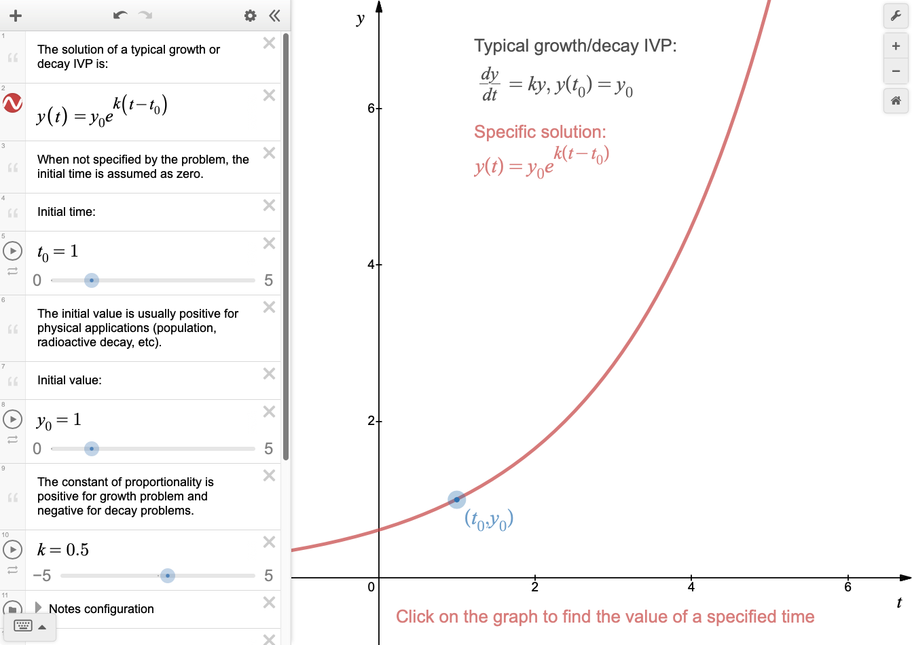
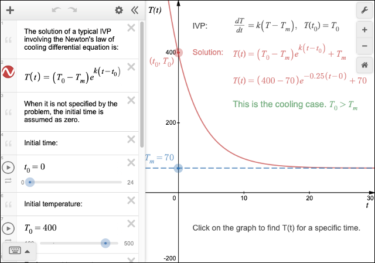
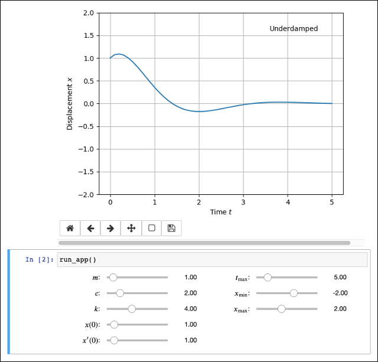
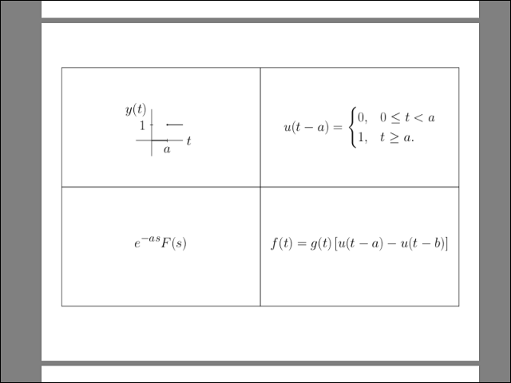
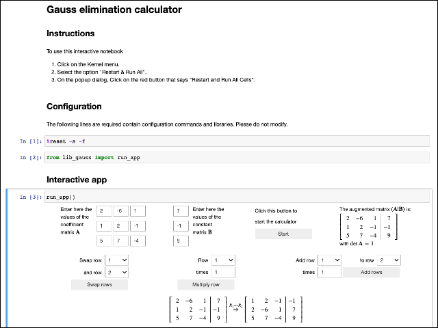

# Welcome to EA1 Tools

Educational tools for the students of EGR-2323 Engineering Analysis 1,
University of Texas at San Antonio

Link to this site: [https://aaguirreme.github.io/ea1_tools/](https://aaguirreme.github.io/ea1_tools/)

## First order ODEs

### Growth or decay solution graph

Click the image to run.  

### Newton's law of cooling solution graph

Click the image to run.  

## Second order ODEs

### Equation of motion of spring-mass systems

Click the image to run online on mybinder.org (it may require to use Google
Chrome).
  
[View source files](https://github.com/aaguirreme/ea1_tools/tree/master/spring_mass_plots)

## Laplace Transforms

### Flashcards to print

Click the image to download the PDF file.  
  
[View source files](https://github.com/aaguirreme/ea1_tools/tree/master/laplace_latex/laplace_latex_v3)

## Linear Algebra

### Gauss Elimination Calculator

Click the image to run online on mybinder.org (it may require to use Google
Chrome).
  
[View source files](https://github.com/aaguirreme/ea1_tools/tree/master/gauss_calc)
